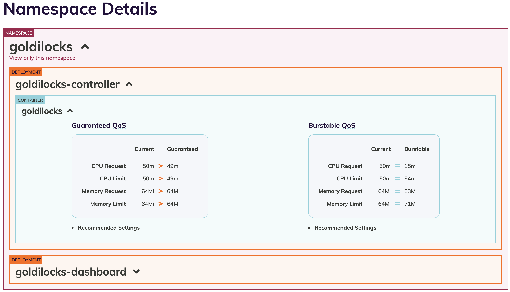

<div align="center">

<br>

<h3>Get your resource requests "Just Right"</h3>

[](https://circleci.com/gh/FairwindsOps/goldilocks) [](https://codecov.io/gh/FairwindsOps/goldilocks) [](https://opensource.org/licenses/Apache-2.0)
</div>

## How can this help with my resource settings?

By using the kubernetes [vertical-pod-autoscaler](https://github.com/kubernetes/autoscaler/tree/master/vertical-pod-autoscaler) in recommendation mode, we can see a suggestion for resource requests on each of our apps. This tool creates a VPA for each deployment in a namespace and then queries them for information.

Once your VPAs are in place, you'll see recommendations appear in the Goldilocks dashboard:
<div align="center">

</div>

**Want to learn more?** Fairwinds holds [office hours on Zoom](https://zoom.us/j/242508205) the first Friday of every month, at 12pm Eastern. You can also re    ach out via email at `opensource@fairwinds.com`

## Requirements

* kubectl
* [vertical-pod-autoscaler](https://github.com/kubernetes/autoscaler/tree/master/vertical-pod-autoscaler) configured in the cluster
* some deployments with pods
* metrics-server (a requirement of vpa)
* golang 1.11+

### Installing Vertical Pod Autoscaler

There are multiple ways to install VPA for use with Goldilocks:

* Install using the `hack/vpa-up.sh` script from the [vertical-pod-autoscaler repository](https://github.com/kubernetes/autoscaler/tree/master/vertical-pod-autoscaler)
* Set the value `installVPA=true` when doing the Helm chart installation of Goldilocks. This will run the script from VPA in your cluster.

#### Important Note about VPA

The full VPA install includes the updater and the admission webhook for VPA. Goldilocks only requires the recommender. An admission webhook can introduce unexpected results in a cluster if not planned for properly. We recommend installing using the chart v2.0.0 or higher, which will only install the parts of VPA necessary for Goldilocks to function.

### Prometheus (optional)

[VPA](https://github.com/kubernetes/autoscaler/tree/master/vertical-pod-autoscaler) does not require the use of prometheus, but it is supported.

### GKE Notes

Google has provided the vertical pod autoscaler as a beta feature in GKE. You can see the docs [here](https://cloud.google.com/kubernetes-engine/docs/how-to/vertical-pod-autoscaling), or just enable it like so:

```
gcloud beta container clusters update [CLUSTER-NAME] --enable-vertical-pod-autoscaling
```

NOTE: This does not support using prometheus as a data backend.

## Installation

First, make sure you satisfy the requirements above.

### Method 1 - Helm (preferred)

```
helm repo add fairwinds-incubator https://charts.fairwinds.com/incubator
helm install --name goldilocks --namespace goldilocks fairwinds-incubator/goldilocks
```

### Method 2 - Manifests

The [hack/manifests](hack/manifests) directory contains collections of Kubernetes YAML definitions for installing the controller and dashboard components in cluster.

```
kubectl create namespace goldilocks
kubectl -n goldilocks apply -f hack/manifests/controller
kubectl -n goldilocks apply -f hack/manifests/dashboard
```

### Enable Namespace

Pick an application namespace and label it like so in order to see some data:

```
kubectl label ns goldilocks goldilocks.fairwinds.com/enabled=true
```

After that you should start to see VPA objects in that namespace.

### Viewing the Dashboard

The default installation creates a ClusterIP service for the dashboard. You can access via port forward:

```
kubectl -n goldilocks port-forward svc/goldilocks-dashboard 8080:80
```

Then open your browser to [http://localhost:8080](http://localhost:8080)

## CLI Usage (not recommended)

Normally we recommend installing as a controller in-cluster. However, it can be run as a CLI if desired.

```
A tool for analysis of kubernetes deployment resource usage.

Usage:
  goldilocks [flags]
  goldilocks [command]

Available Commands:
  controller  Run goldilocks as a controller inside a kubernetes cluster.
  create-vpas Create VPAs
  dashboard   Run the goldilocks dashboard that will show recommendations.
  delete-vpas Delete VPAs
  help        Help about any command
  summary     Genarate a summary of the vpa recommendations in a namespace.
  version     Prints the current version of the tool.

Flags:
      --alsologtostderr                  log to standard error as well as files
  -h, --help                             help for goldilocks
      --kubeconfig string                Kubeconfig location. [KUBECONFIG] (default "$HOME/.kube/config")
      --log_backtrace_at traceLocation   when logging hits line file:N, emit a stack trace (default :0)
      --log_dir string                   If non-empty, write log files in this directory
      --log_file string                  If non-empty, use this log file
      --log_file_max_size uint           Defines the maximum size a log file can grow to. Unit is megabytes. If the value is 0, the maximum file size is unlimited. (default 1800)
      --logtostderr                      log to standard error instead of files (default true)
      --master string                    The address of the Kubernetes API server. Overrides any value in kubeconfig. Only required if out-of-cluster.
      --skip_headers                     If true, avoid header prefixes in the log messages
      --skip_log_headers                 If true, avoid headers when opening log files
      --stderrthreshold severity         logs at or above this threshold go to stderr (default 2)
  -v, --v Level                          number for the log level verbosity
      --vmodule moduleSpec               comma-separated list of pattern=N settings for file-filtered logging

Use "goldilocks [command] --help" for more information about a command.
```
### controller

This starts the goldilocks controller. Used by the Docker container, it will create vpas for properly labelled namespaces.

#### Flags
You can set the default behavior for VPA creation using some flags. When specified, labels will always take precedence over the command line flags.

* `--on-by-default` - create VPAs in all namespaces
* `--include-namespaces` - create VPAs in these namespaces, in addition to any that are labeled
* `--exclude-namespaces` - when `--on-by-default` is set, exclude this comma-separated list of namespaces

### create-vpas

`goldilocks create-vpas -n some-namespace`

This will search for any deployments in the given namespace and generate a VPA for each of them.  Each vpa will be labelled for use by this tool.

### delete-vpas

This will delete all vpa objects in a namespace that are labelled for use by this tool.

### dashboard

`goldilocks dashboard`

Runs the goldilocks dashboard web server that will display recommendations. Listens on port `8080` by default.

### summary

`goldilocks summary`

Queries all the VPA objects that are labelled for this tool across all namespaces and summarizes their suggestions into a JSON object.

### Container Exclusions

The `dashboard` and `summary` commands can exclude recommendations for a list of comma separated container names using the `--exclude-containers` argument. This option can be useful for hiding recommendations for sidecar containers for things like Linkerd and Istio.

Containers can be excluded for individual deployments by applying a label to any deployment. The label value should be a list of comma separated container names. The label value will be combined with any values provided through the `--exclude-containers` argument.

Example label:

`kubectl label deployment myapp goldilocks.fairwinds.com/exclude-containers=linkerd-proxy,istio-proxy`
